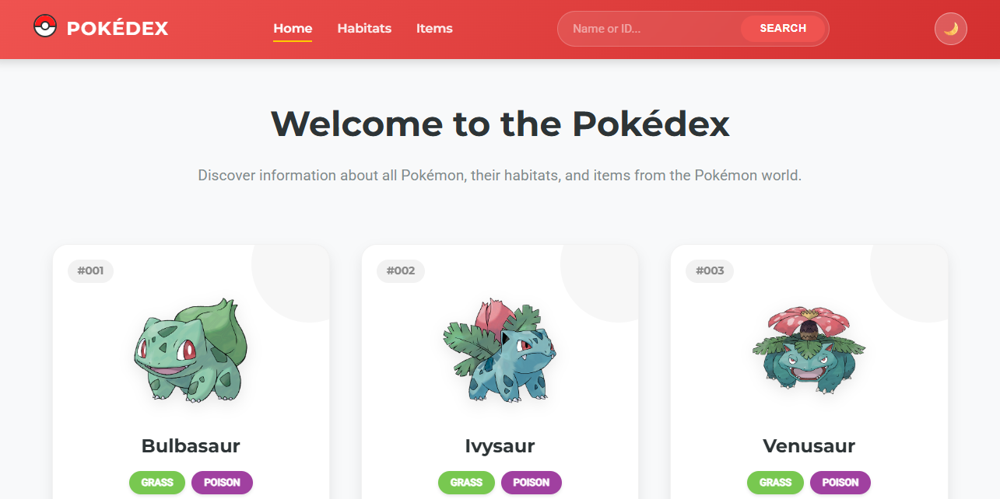
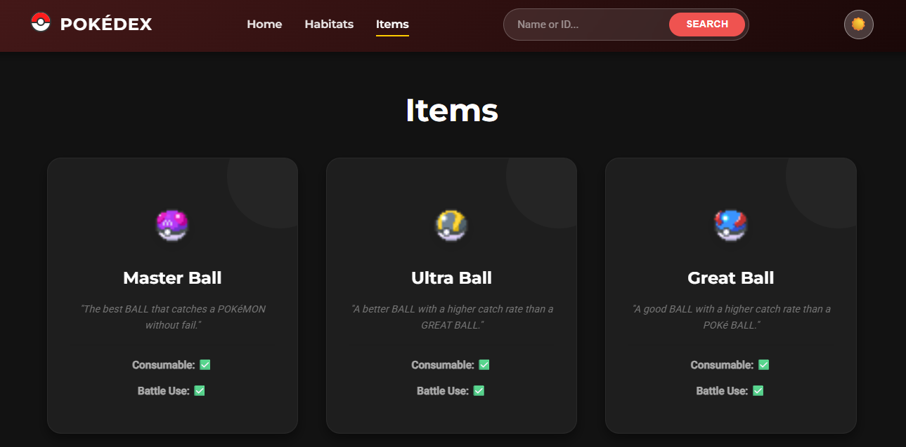

#  PokéDex - PokéAPI Project


## 🌐 Live Demo
[Check out the live project here!](https://urion-sertor.github.io/introduccion-a-peticiones-get/)

A modern, responsive Pokédex application built with vanilla JavaScript, HTML5, and CSS3. This project demonstrates how to consume a REST API (PokéAPI) and handle asynchronous operations efficiently.

## 📸 Screenshots

<div align="center">
  
  
</div>

## 🚀 Features

- **Dynamic Pokémon List:** Fetches and displays a grid of Pokémon with manual infinite scroll functionality.
- **Habitat Filtering:** Explore Pokémon grouped by their natural habitats (cave, forest, grassland, etc.).
- **Item Discovery:** A dedicated section to browse items from the Pokémon world, including descriptions and attributes.
- **Search Functionality:** Search for specific Pokémon by name or ID.
- **Night Mode:** Toggle between light and dark themes. Your preference is saved in `localStorage`.
- **Responsive Design:** Optimized for mobile, tablet, and desktop views.
- **Interactive Elements:** Includes Pokémon cries (audio) and game version information.

## 🛠️ Technologies Used

- **HTML5:** Semantic structure.
- **CSS3:** Custom properties (variables), Flexbox, Grid, and animations.
- **JavaScript (ES6+):** 
  - `fetch` API for network requests.
  - `async/await` for asynchronous logic.
  - `Promise.all` for parallel data fetching.
  - DOM manipulation and event handling.
- **PokéAPI:** The source of all Pokémon data.

## 📦 How to Run

1. Clone the repository:
   ```bash
   git clone https://github.com/urion-sertor/introduccion-a-peticiones-get.git
   ```
2. Open `index.html` in your favorite web browser.
3. Enjoy exploring the Pokémon world!

## 🙏 Acknowledgments

[PokéAPI](https://pokeapi.co/) for providing the amazing data.

Pokémon and Nintendo for the inspiration.

---

**Developed by Oriol Torres [urion-sertor]**